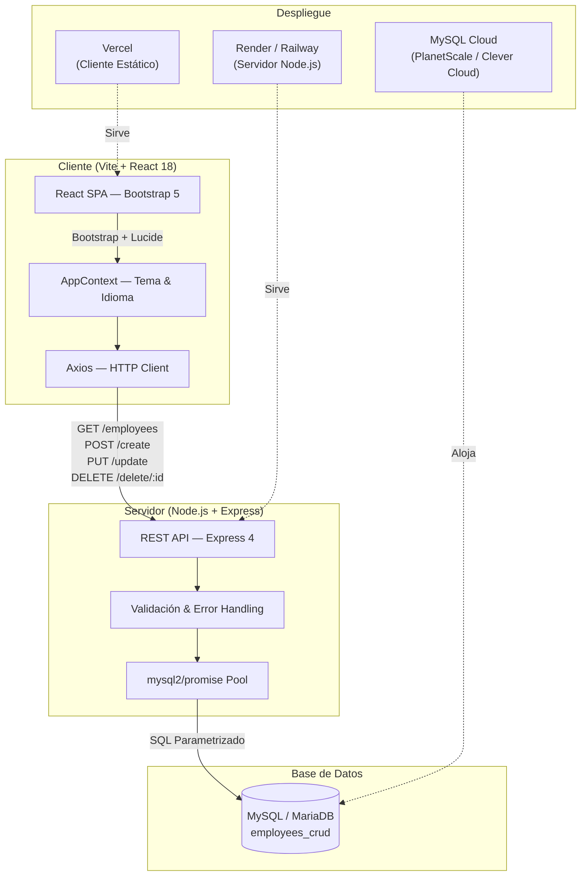
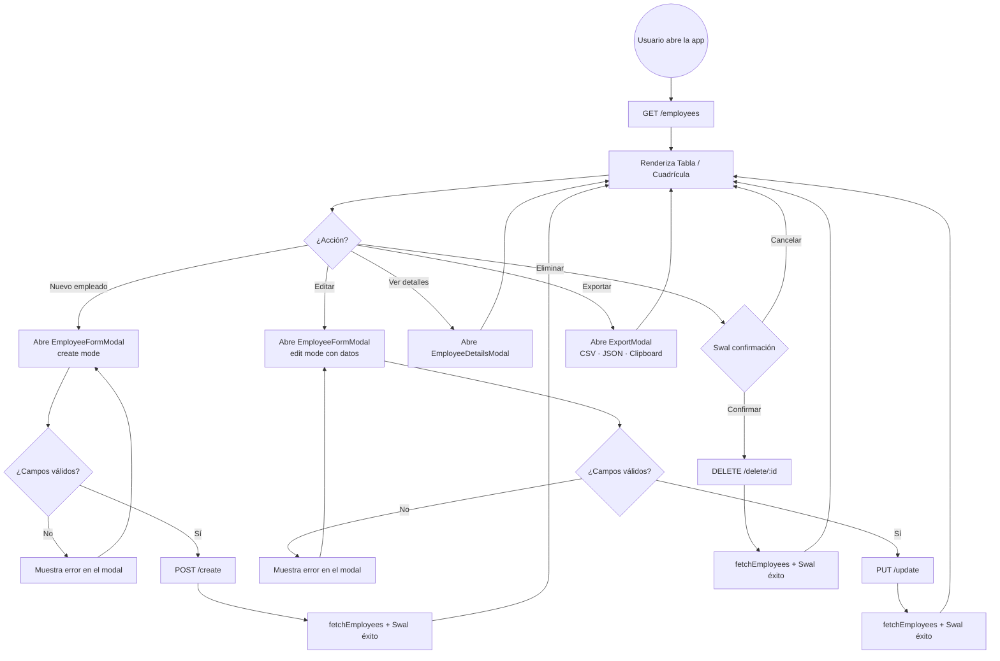
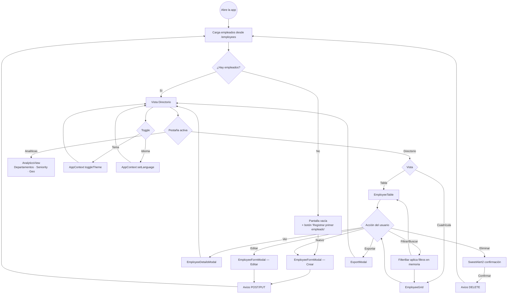
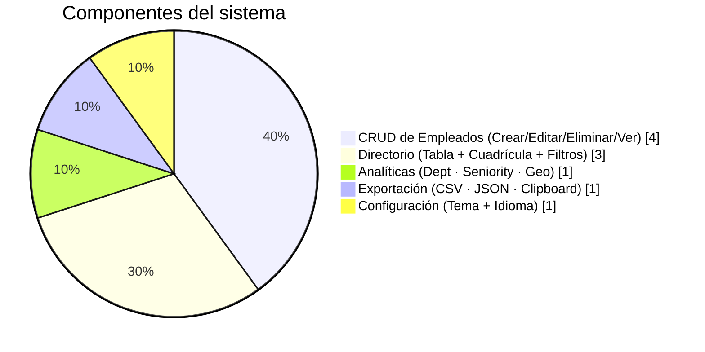

# 🏢 StaffMatrix — Employee Management System

[](https://react.dev/)
[](https://getbootstrap.com/)
[](https://vitejs.dev/)
[](https://nodejs.org/)
[](https://expressjs.com/)
[](https://www.mysql.com/)
[](LICENSE)

Sistema integral de **gestión de empleados y directorio de personal corporativo** con CRUD completo, vistas de analíticas, exportación de datos, modo oscuro/claro y soporte bilingüe (ES/EN). Desarrollado con **React 18 + Vite** en el cliente y **Node.js + Express + MySQL** en el servidor, con arquitectura **cliente/servidor separados** lista para despliegue en **Vercel** (front) + cualquier VPS/Railway/Render (back).

---

## 📋 Tabla de Contenidos

- [✨ Características Principales](#-características-principales)
- [📸 Vista de la Aplicación](#-vista-de-la-aplicación)
- [🏛️ Diagrama de Arquitectura](#️-diagrama-de-arquitectura)
- [🔄 Flujo CRUD de Empleados](#-flujo-crud-de-empleados)
- [🧩 Diagrama de Componentes](#-diagrama-de-componentes)
- [🗺️ Diagrama de Flujo de Usuario](#️-diagrama-de-flujo-de-usuario)
- [📊 Distribución de Módulos](#-distribución-de-módulos)
- [🛠️ Stack Tecnológico](#️-stack-tecnológico)
- [📁 Estructura del Proyecto](#-estructura-del-proyecto)
- [⚙️ Configuración de Variables de Entorno](#️-configuración-de-variables-de-entorno)
- [🗄️ Configuración de la Base de Datos](#️-configuración-de-la-base-de-datos)
- [🚀 Instalación y Ejecución Local](#-instalación-y-ejecución-local)
- [☁️ Despliegue en Vercel + Render/Railway](#️-despliegue-en-vercel--renderrailway)

---

## ✨ Características Principales

| Módulo | Descripción |
|---|---|
| **📋 Directorio** | Tabla y cuadrícula de empleados con búsqueda en tiempo real |
| **➕ Registro** | Modal de alta con vista previa en vivo de la ficha del colaborador |
| **✏️ Edición** | Modal de edición con validación de campos obligatorios |
| **🗑️ Eliminación** | Confirmación con SweetAlert2 antes de borrar |
| **📊 Analíticas** | Distribución por departamento, seniority y presencia geográfica |
| **🔍 Filtros** | Por país, departamento, nivel de experiencia y ordenamiento |
| **📤 Exportación** | CSV/Excel, JSON y copia al portapapeles |
| **🌗 Dual Theme** | Modo Oscuro y Claro persistente con toggle instantáneo |
| **🌐 Bilingüe** | Interfaz completa en Español e Inglés (ES/EN) |
| **🏳️ Banderas** | Selector de país con banderas SVG via `country-flag-icons` |
| **📱 Responsive** | Diseño adaptable a móvil, tablet y escritorio con Bootstrap 5 |

---

## 📸 Vista de la Aplicación

### 1. Interfaz principal del directorio


### 2. Formulario de registro de empleado


### 3. Confirmación de registro exitoso


### 4. Edición de empleado existente


### 5. Confirmación de eliminación con SweetAlert2


---

## 🏛️ Diagrama de Arquitectura



---

## 🔄 Flujo CRUD de Empleados



---

## 🧩 Diagrama de Componentes

```mermaid
flowchart TB
    subgraph Client["src/ (React)"]
        APP["App.jsx\n(orquestador)"]

        subgraph Components["src/components/"]
            HDR["Header.jsx\nNavbar + Tabs + Theme + Lang"]
            STATS["StatsBar.jsx\nKPIs del directorio"]
            FILTER["FilterBar.jsx\nBúsqueda + Filtros + Ordenamiento"]
            TABLE["EmployeeTable.jsx\nVista de tabla"]
            GRID["EmployeeGrid.jsx\nVista de cuadrícula"]
            FORM["EmployeeFormModal.jsx\nCrear / Editar"]
            DETAILS["EmployeeDetailsModal.jsx\nFicha del colaborador"]
            ANALYTICS["AnalyticsView.jsx\nGráficos y métricas"]
            EXPORT["ExportModal.jsx\nCSV · JSON · Clipboard"]
            FLAG["CountryFlag.jsx\nBandera SVG"]
            SEL["CountrySelect.jsx\nSelector de país"]
            FSEL["CountryFilterSelect.jsx\nFiltro de país"]
        end

        subgraph Context["src/context/"]
            CTX["AppContext.jsx\nTema · Idioma · t()"]
        end

        subgraph Locales["src/locales/"]
            I18N["translations.js\nES + EN completos"]
        end

        subgraph Utils["src/utils/"]
            AVT["avatars.ts\nAvatares generativos"]
        end
    end

    subgraph ServerSide["server/"]
        IDX["index.js\nExpress REST API"]
        ENV[".env\nDB_HOST · DB_USER · DB_PASS"]
        SQL["database.sql\nSchema + seed data"]
    end

    APP --> HDR & STATS & FILTER & TABLE & GRID & ANALYTICS
    APP --> FORM & DETAILS & EXPORT
    APP --> CTX
    CTX --> I18N
    FORM --> FLAG & SEL & AVT
    TABLE --> FLAG
    GRID --> FLAG & AVT
    FILTER --> FSEL
    APP -->|Axios HTTP| IDX
    IDX --> ENV & SQL
```



---

## 🗺️ Diagrama de Flujo de Usuario



---

## 📊 Distribución de Módulos



---

## 🛠️ Stack Tecnológico

### Cliente (`client/`)

| Capa | Tecnología | Versión | Propósito |
|---|---|---|---|
| **Framework UI** | React | 18.3 | SPA reactiva y componentizada |
| **Build Tool** | Vite | 5.2 | Compilación rápida + HMR |
| **Estilos** | Bootstrap | 5.3 | Grid, componentes y utilidades |
| **Iconografía** | Lucide React | 0.378 | Iconos vectoriales coherentes |
| **HTTP** | Axios | 1.6 | Peticiones REST al servidor |
| **Alertas** | SweetAlert2 | 11 | Confirmaciones y notificaciones |
| **Banderas** | country-flag-icons | 1.6 | Flags SVG de todos los países |
| **Tipografía** | Plus Jakarta Sans | — | Fuente principal (Google Fonts) |

### Servidor (`server/`)

| Capa | Tecnología | Versión | Propósito |
|---|---|---|---|
| **Runtime** | Node.js | ≥ 18 | Entorno de ejecución |
| **Framework** | Express | 4.19 | API REST |
| **Base de datos** | MySQL / MariaDB | 8.0+ | Persistencia de datos |
| **Driver DB** | mysql2 | 3.9 | Driver async/await con pool |
| **Variables** | dotenv | 16.4 | Configuración por entorno |
| **CORS** | cors | 2.8 | Control de origen cruzado |
| **Dev** | nodemon | 3.1 | Recarga en caliente del servidor |

---

## 📁 Estructura del Proyecto

```
📦 Form-with-React-MySql-NodeJs-Bootstrap/
├── 📂 client/                    # Frontend — React + Vite
│   ├── 📂 public/
│   │   └── favicon.ico
│   ├── 📂 src/
│   │   ├── 📂 assets/images/     # Avatares generativos
│   │   ├── 📂 components/        # Componentes UI
│   │   │   ├── AnalyticsView.jsx
│   │   │   ├── CountryFilterSelect.jsx
│   │   │   ├── CountryFlag.jsx
│   │   │   ├── CountrySelect.jsx
│   │   │   ├── EmployeeDetailsModal.jsx
│   │   │   ├── EmployeeFormModal.jsx
│   │   │   ├── EmployeeGrid.jsx
│   │   │   ├── EmployeeTable.jsx
│   │   │   ├── ExportModal.jsx
│   │   │   ├── FilterBar.jsx
│   │   │   ├── Header.jsx
│   │   │   └── StatsBar.jsx
│   │   ├── 📂 context/
│   │   │   └── AppContext.jsx     # Tema & Idioma
│   │   ├── 📂 locales/
│   │   │   └── translations.js   # ES + EN
│   │   ├── 📂 utils/
│   │   │   └── avatars.ts
│   │   ├── App.jsx               # Componente raíz
│   │   ├── App.css               # Estilos globales
│   │   └── index.jsx             # Entry point
│   ├── index.html
│   ├── vite.config.js
│   ├── package.json
│   ├── vercel.json               # Config SPA routing para Vercel
│   └── .env.example
│
├── 📂 server/                    # Backend — Node.js + Express
│   ├── index.js                  # API REST (CRUD completo)
│   ├── database.sql              # Schema + seed data
│   ├── package.json
│   └── .env.example
│
├── .gitignore
├── LICENSE
└── README.md
```

---

## ⚙️ Configuración de Variables de Entorno

### Servidor (`server/.env`)

Crea un archivo `server/.env` copiando `server/.env.example`:

```env
PORT=3001

DB_HOST=localhost
DB_USER=root
DB_PASSWORD=tu_contraseña
DB_NAME=employees_crud

# URL del cliente para CORS (sin barra final)
CLIENT_URL=http://localhost:3000
```

### Cliente (`client/.env`)

Crea un archivo `client/.env` copiando `client/.env.example`:

```env
# Deja vacío para usar el proxy de Vite en desarrollo local
# En producción apunta a la URL pública de tu servidor
VITE_API_URL=
```

> **En producción** (Vercel) inyecta `VITE_API_URL=https://tu-server.onrender.com` en las variables de entorno del proyecto en el dashboard de Vercel. **Nunca subas archivos `.env` al repositorio.**

---

## 🗄️ Configuración de la Base de Datos

1. Asegúrate de tener **MySQL 8.0+** o **MariaDB 10.5+** instalado.
2. Ejecuta el script de configuración:

```bash
mysql -u root -p < server/database.sql
```

Esto crea la base de datos `employees_crud`, la tabla `employees` con el schema correcto y carga 6 registros de ejemplo.

### Schema de la tabla `employees`

| Columna | Tipo | Descripción |
|---|---|---|
| `id` | INT AUTO_INCREMENT PK | Identificador único |
| `name` | VARCHAR(150) | Nombre completo |
| `age` | TINYINT UNSIGNED | Edad |
| `country` | VARCHAR(100) | País de residencia |
| `workPosition` | VARCHAR(150) | Cargo / puesto laboral |
| `yearsWork` | TINYINT UNSIGNED | Años de experiencia |
| `created_at` | DATETIME | Fecha de registro |
| `updated_at` | DATETIME | Última modificación |

---

## 🚀 Instalación y Ejecución Local

### Prerrequisitos

- Node.js ≥ 18
- npm ≥ 9
- MySQL 8.0+ o MariaDB 10.5+

### 1. Clonar el repositorio

```bash
git clone https://github.com/LuisFCosteC/Form-with-React-MySql-NodeJs-Bootstrap.git
cd Form-with-React-MySql-NodeJs-Bootstrap
```

### 2. Configurar y arrancar el servidor

```bash
cd server
npm install
cp .env.example .env          # edita DB_PASSWORD y DB_HOST
mysql -u root -p < database.sql
npm run dev                   # nodemon en http://localhost:3001
```

### 3. Configurar y arrancar el cliente

Abre una **nueva terminal**:

```bash
cd client
npm install
cp .env.example .env          # deja VITE_API_URL vacío para usar proxy
npm run dev                   # Vite en http://localhost:3000
```

Abre `http://localhost:3000` en el navegador. El proxy de Vite reenvía automáticamente las llamadas `/employees`, `/create`, `/update`, `/delete` y `/api/*` al servidor en el puerto 3001.

---

## ☁️ Despliegue en Vercel + Render/Railway

### Cliente → Vercel

1. Conecta el repositorio en [vercel.com](https://vercel.com).
2. En **Root Directory** selecciona `client/`.
3. Vercel detecta Vite automáticamente.
4. En **Environment Variables** añade:
   ```
   VITE_API_URL = https://tu-servidor.onrender.com
   ```
5. El archivo `client/vercel.json` ya maneja el rewrite de SPA (no hay 404 al recargar rutas).
6. Haz clic en **Deploy** ✅

### Servidor → Render (opción gratuita)

1. Crea un nuevo **Web Service** en [render.com](https://render.com).
2. **Root Directory**: `server/`
3. **Build Command**: `npm install`
4. **Start Command**: `npm start`
5. En **Environment Variables** añade `DB_HOST`, `DB_USER`, `DB_PASSWORD`, `DB_NAME`, `CLIENT_URL` y `PORT=3001`.
6. En **Add-ons** o servicios externos, provisiona una base de datos MySQL compatible (Clever Cloud, PlanetScale, etc.).
7. Haz clic en **Create Web Service** ✅

### Servidor → Railway (alternativa)

```bash
# Instala Railway CLI
npm i -g @railway/cli
railway login
railway init
railway up --service server
```

---

## 🔌 Endpoints de la API

| Método | Endpoint | Descripción |
|---|---|---|
| `GET` | `/employees` | Lista todos los empleados |
| `POST` | `/create` | Crea un nuevo empleado |
| `PUT` | `/update` | Actualiza un empleado (requiere `id`) |
| `DELETE` | `/delete/:id` | Elimina un empleado por ID |
| `GET` | `/health` | Estado del servidor y timestamp |

### Ejemplo de payload (POST /create · PUT /update)

```json
{
  "name":         "Ana García",
  "age":          27,
  "country":      "España",
  "workPosition": "Frontend Developer",
  "yearsWork":    3
}
```

---

## 📄 Licencia

Distribuido bajo la Licencia **MIT**. Consulta [`LICENSE`](LICENSE) para más información.

---

<div align="center">
  <strong>Desarrollado con ❤️ por <a href="https://github.com/LuisFCosteC">Luis F. Coste C.</a></strong><br/>
  <sub>React · Node.js · Express · MySQL · Bootstrap 5 · Vite</sub>
</div>
